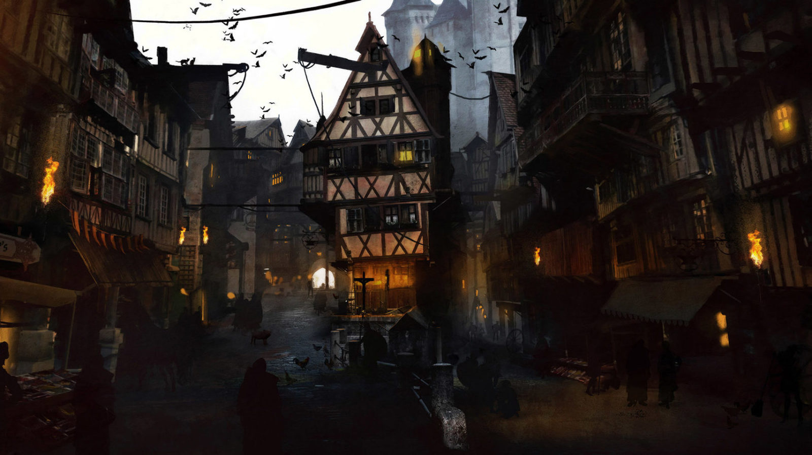

{.size-cover}

La Bouilloire de madame Freona est un mystère pour beaucoup. Au sein de la tumultueuse ville de Phlan, c’est un endroit où les gens peuvent aller pour boire ou prendre un repas et s’échapper un temps de la tension des intrigues... et de la faim. L’endroit a la réputation d’être un havre, et les aventuriers qui savent être discrets et bien se comporter peuvent souvent y trouver un emploi.
Les personnages donc ont entendu dire que l’auberge de la Bouilloire de madame Freona était un excellent endroit pour trouver du travail, et c’est pour cela qu’ils s’y sont rendus.

# Carte de la ville de phlan

*source: https://www.reddit.com/r/dndmaps/comments/64ty6a/city_of_phlan_available_at_dms_guild/*
