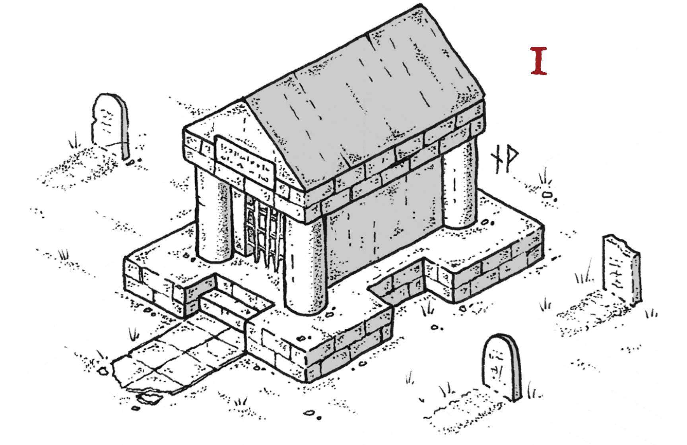
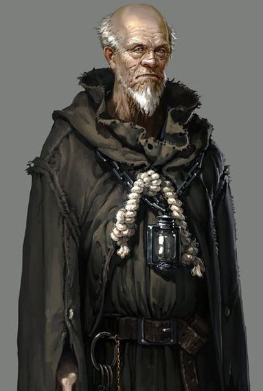

# La mort de Midi

___

<!-- TOC START min:2 max:3 link:true asterisk:false update:false -->
- [Le Gardien des morts](le-gardien-des-morts)
- [Le Mausolee Xandria](le-mausolee-xandria)
- [Sous la Crypte](sous-la-crypte)
  - [La Garde d'honneur](la-garde-dhonneur)
  - [La Chambre de Reanimation](la-chambre-de-reanimation)
  - [Le Cercle de teleportation](le-cercle-de-teleportation)
- [Informer le Frere Keefe](informer-le-frere-keefe)
<!-- TOC END -->

___

Un prêtre du cimetière de Valhingen s'entretient avec les personnages d'un problème inquiétant.

> La foule à la Bouilloire est clairsemée pour le repas de midi. La plus jeune des filles de madame Freona, Grelinda, est en train de déblayer votre table après un repas agréable. Les cheveux courts de Grelinda sont teints d'une étrange couleur vert-cuivre, et elle traite rudement les assiettes au fur et à mesure qu’elle les empile sur un plateau. « Stupide travail ennuyeux » marmonne-t-elle dans sa barbe.
> Avant que vous ne puissiez opiner, la porte de la Bouilloire s'ouvre, et entre un grand homme d'allure austère. Son regard balaye la salle commune, puis son expression blême se fixe enfin sur vous.
> Il enlève alors son chapeau haut de forme noir, révélant ainsi sa calvitie : « Je suis désolé de vous déranger » dit-il d'une voix monotone mais profonde. « Je suppose que vous êtes des aventuriers qu'on peut embaucher, et je sollicite votre expertise pour une petite affaire »
{.read}

## Le Gardien des morts

- L'homme est Frère Keefe, prêtre de Kelemvor
- Gardien des Morts au cimetière de Valhingen à Phlan / Surveillant des résidents permanents du cimetière de Valhingen.

> Mais... je suis aussi en charge des exhumations, et c'est cela qui m'amène ici cette après-Midi.
> Le fait est des dires ont été rapportés aux prêtres de Kelemvor: un des résidents de longue date, **Xandria Welltran**, ne serait pas une humaine mais un dragon vert métamorphosée. Ce ne sont que des dires mais je craint que quelque chose de louche se cache derrière tout cela.
> Malheurusement, les autres prêtres de mon ordre se rient de mes préoccupations. En attendant, je suis le gardien de ce cimmetierre et je suis responsable de ce qui s'y trame.
> Je cherche donc de courageux aventuriers pour m'accompagner dans la crypte et eclaircir cette histoire...
> Je vous pairai 100 pièces d'or, et c'est plus difficile que prévu, je suis prêt à ajouter un [parchemin de protection contre le mal et le bien](/spell/protection-from-evil-and-good)
{.read}

Si les personnages sont satisfaits de l'explication et des modalités, Frère Keefe les conduit au le cimetière de Valhingen.

> Vous traversez les rues commercantes agitées de Phlan jusqu'à arriver au paisible cimetierre de Valhingen. A une légère pluie clapote sur vos tête et le parfum de mousse, de terre et de fleurs emplissent vos narines.
>
> _"Yovir Glandon, mon supérieur, première personnalité du très solennel ordre du Suaire silencieux, veille personnellement à l'entretien du terrain. Nous avons la chance d'avoir un si beau cimetierre à Phlan, les mort y reposent en paix"_
>
> Il vous conduit jusqu'à un mausolé fait de marbre noir nervuré (d'environ 7.5m de coté) sur lequel est inscrit __"Crypte Welltran"__.
{.read}

## Le Mausolee Xandria

> Frère Keefe introduit une clef pour en ouvrir la porte.
> L'intérieur est tout aussi bien d'apparence. Les murs sont sculptés et peints, représentant différentes scènes qui montrent une jolie femme humaine dans différents endroits :
> * regardant vers un pic enneigé,
> * debout sous la pluie d'un orage,
> * assise dans une chambre confortable auprès d'un feu de cheminée,
> * tenant un serpent venimeux dans un jardin et
> * travaillant avec des flacons dans un laboratoire.
> Le couvercle du sarcophage de marbre au centre de la pièce est sculpté à l'effigie de la même femme humaine dans la fleur de sa vie.
{.read}

Pendant que les joueurs examinent ces sculptures, le Frère Keefe ouvre le couvercle du sarcophage:
- il contient un tas d'os confus. (🔎 Medecine DD12) Ce ne sont pas des os humains, nombre d'entre eux semblent draconiques. On peut aussi remarquer qu'il en manque au moins la moitié)
- Il y a aussi 5 minuscules petites pierres précieuses: un rubis, une émeraude, un opale noire, un diamant blanc et un saphir.

#### Le piège et le passage secret

**Activation du piège**

Peu de temps après que les restes aient été dérangés et analysé:

> Quelques instants après que le couvercle ait est retiré et le contenu du sarcophage examiné, un raclement résonne dans la crypte. La porte se ferme et se verrouille, et un bruit de sifflement vous fait prendre conscience qu'un gaz entre dans la crypte. Il n'a pas une odeur agréable.
{.read}

🎵 Ambiance sonore : https://www.youtube.com/watch?v=JYFU_RiefKk

1. Lancer l'initiative (Laisser 2 tours avant que le gaz de fasse effet)
2. Leur laisser ce temps pour investiguer la pièce:
  > - (🔎 Investigation DD10 sur le sarcophage) il y a des marques d'éraflures sur le sol autour du sarcophage qui laissent penser que celui-ci peut se déplacer. Pousser ne fait rien.
  > - (🔎 Investigation DD10 sur les pierres ) Les minuscules pierres précieuses sont toutes de la même taille et de la même forme, et elles sont coupées d'une manière qui fait penser qu'elles pourraient entrer dans quelque chose.
  > - (🔎 Investigation DD10 sur les sculptures) les sculptures sur les murs possèdent un orifice dans lequel une petite pierre pourrait être insérée (voir solution).
3. Après deux tours, le gaz inflige 3 (1d6) points de dégâts de poison. Réussir un jet de sauvegarde de Constitution DD 12 réduit les dégâts de moitié. Après cela, c'est Frère Keefe qui se rendra compte que les pierres précieuses pourraient entrer dans ces orifices.
4. S'ils mettent les mauvaises pierre au mauvaiset endroit: un seul autre jet de sauvegarde avant que Frère Keefe ne leur fournisse suffisamment d'indices pour parvenir à résoudre le puzzle correctement.

**Solution**

Chaque pierre doit être placé à un emplacement précis (correspondance sur la couleur)

- Le diamant blanc entre dans un trou au sommet de la montagne couverte de neige.
- Le saphir bleu dans un trou sur un éclair de l'orage.
- Le rubis rouge dans un trou sur le feu de la cheminée.
- L'émeraude verte dans un trou sur le croc du serpent venimeux.
- L'opale noire dans un trou sur un flacon d'acide.

Lorsque les gemmes sont correctement insérées:
> Le sifflement du gaz s'estompe et vous sentez de l'air frais parvenir jusqu'à vos poumon. La porte de la crypte s'ouvre derrière vous alors que vous sentez de l'air sec et froid vous fait frissoner. Il provient du centre de la pièce ou le sarcophage se déplace doucement, laissant apparaitre des escaliers s'enfoncant dans les ténèbres des profondeurs.
{.read}

>(🔎 Investigation DD15) Des traces dans la poussière montrent qu'il a été récemment utilisé par au moins deux créatures de taille humaine.

Frere Keefe refuse d'entrer dans les cavités inférieures.

## Sous la Crypte

Ambiance: https://www.youtube.com/watch?v=a483kj0sR4c

| Types           | Description                                                                |
| --------------- | -------------------------------------------------------------------------- |
| **Plafonds**        | Dans les pièces sous la crypte, tous les plafonds sont à 3 mètres de haut. |
| **Lumière**         | Aucune des zones sous la crypte n'est éclairée.                            |
| **Portes secrètes** | Trois portes secrètes sont cachées dans la paroi en spirale. Elles peuvent être remarquées en cas de réussite à un jet de Sagesse (Perception) DD 15. Les êtres vivants qui passent à travers prennent 2 (1d4) dégâts nécrotiques. Les morts-vivants qui les traversent récupèrent 2 points (1d4) points de vie. Les morts-vivants connaissent leur présence mais ne les utilisent que pour des fins tactiques, par pour reprendre des pv.                                                                           |

##### MJ

##### Player friendly

### La Garde d'honneur

> Le passage débouche dans une pièce. Trois étranges squelettes humanoïdes, surmontés de crânes draconiques, s'y tiennent droit, tenant des épées. Au fond de la pièce se trouve un grand fauteuil en forme de trône, actuellement vide, sur une estrade acajou.
{.read}

- **3 squelettes**

  Ces 3 [squelettes](/monster/skeleton) ne sont pas animés, sauf si:
  - une créature s'assoit sur le trone,
  - une créature suit les instructions sur les livres dans la salle B.

- **Le Trone**:
  - (🔎 Investigation DD10)  Si un personnage s'assoit sur le trône, ou fouille le trône tout en réussissant un jet, il remarque un panneau articulé dans le bas du trône.
  - ❌ Piège: Aiguille empoisonée
    - detectable (🔎 Perception DD15)
    - desamorcable (Dextérité DD 15, + thieves tools).
    - Si le panneau est ouvert sans désarmer le piège: JdS CON DD12 ou 1d8 dgts
  - 💰
    - Une tourmaline (petite pierre precieuse, 50po)
    - un parchemin de [comprehension des langues](/spell/comprehend-languages)

### La Chambre de Reanimation

> Le passage en spirale continue de descendre en légère pente, jusqu'à atteindre une autre pièce.
> Cette pièce est équipée comme un petit laboratoire. Les tables tout autour sont recouvertes de fioles, de livres, de chaudrons, de casseroles et de pleins d'autres outils d'alchimie.
> Au milieu de la table centrale se trouve un papier à côté d'un pot en argile bleu. Le texte, rédigé en commun, dit « Raaxil, j'ai compris comment terminer le processus. Lorsque vous serez prêt, il suffit de verser le contenu de ce pot bleu dans le chaudron et de remuer. Les effets devraient être instantanés, mais attention, NE PAS BOIRE la potion qui en résulte ».
{.read}

- **Materiel d'alchimie**
  - (🔎 Arcanes DD15) Les livres et le matériel d'alchimie sont tous liés à la nécromancie, et spécifiquement ciblés vers les dragons. C'est une magie extrêmement avancée, bien au-delà de leur l'expertise.
  - **completer le processus**: provoque une vapeur épaisse qui se répand rapidement dans les chambres, animant les squelettes de la salle précédente. Si les personnages les ont déjà abattus, les squelettes s'animent de nouveau.
  - **boire la potion**: Un personnage assez fou pour boire de la potion doit réussir un jet de sauvegarde de Constitution DD 20 ou prendre 21 (6d6) dégâts de poison.
  - **Sortir le materiel de la crypte**: Tout ce matériel est maudit magiquement. S'il est extrait du complexe souterrain, il se dissout.

### Le Cercle de teleportation

>La légère spirale continue en pente et débouche sur une nouvelle salle.
>
>Les murs de cette pièce sont peints pour ressembler à l'intérieur de la tanière d'un dragon. Les scènes représentent des tas de trésors, des acolytes en robe s'inclinant pour supplier, des prisonniers ligotés servis comme repas, etc. Tous les tableaux font face à l'alcôve dans le mur sud, où un tas de pièces d'or forment un nid parfait pour un grand dragon !
>
> En plus des peintures, il y a quatre grands glyphes : un sur le mur nord, un au sud, un à l'est et un à l'ouest. Le glyphe au sud est dans l'alcôve. Ces glyphes brillent légèrement dans l'obscurité.
>
> Dans le coin nord-ouest de la salle, un cercle de téléportation a été gravé au sol. L'absence d'usure des gravures laisse penser que le cercle a été créé très récemment. Une tige de métal épaisse, sur laquelle sont inscrits des sceaux, se dresse au milieu du cercle.
>
> Gisant au sol dans différentes parties de la pièce se trouvent 4 cadavres. Bien que les corps semblent à peu près humanoïdes, ils semblent faits de différentes parties cousues entre-elles, et certains semblent être draconiens de nature.
{.read}

- **Déclenchement innévitable**
  - Dès que les joueurs interagissent avec quoi que ce soit de façon significative (toucher, examiner,...), 2 choses se produisent:
    - les 4 glyphes s'activent
    - Les 4 corps s'animent. Ce sont des [zombies](/monster/zombie) avec des traits physiques draconiques.

- **Les Glyphes**
  - Les glyphes s'illumines lorsque les zombies frappent ou recoivent des dégats
  - elles peuvent etre détruite (CA 10, 5 pv) ou désactivées (Arcanes DD 10),
  - si une glyphe est désactivée, l'un des zombie devient aveugle jusqu'à la fin de son prochain tour.
  - si toutes les glyphes sont désactivées, les zombies tombent inanimés.

- **L'alcove**
  - Si un personnage entre dans l'alcôve du sud, il déclenche un champ de force invisible à travers l'ouverture de l'alcôve.
  - Ce champ de force est impénétrable, mais peut être désactivé par un jet d'Intelligence (Arcanes) DD 10 réussi ou par 5 points de dégâts de force.
  - Il disparaît également si tous les glyphes sont désactivés.

- **Le Cercle de téléportation**
  - Le cercle de téléportation peut être facilement effacé pour le rendre inutilisable.
  - (🔎 Arcanes DD 15) Le cercle de téléportation est probablement lié à un cercle semblable ailleurs, et une puissante magie est nécessaire pour utiliser les cercles.

## Informer le Frere Keefe

Le frère Keefe cherche à savoir ce que les aventuriers ont pu découvrir.

>A la sortie du mausolée, vous voyez le frère Keene soulagé de vous voir. Il se précipite vers vous.
J’ai entendu des bruits atroces venant de la crypte ! Oh Kelemvor tu as entendu mes prières !
>tu n’as pas emporté ces valeureux aventuriers trop tot dans ton royaume des morts, merci. Alors, vous avez trouver quelquechose ? Qu’est-ce qu’il se trame là dessous ?
{.read}


Si les personnages font le lien entre la nécromancie et les différents aspects draconiens, il suggère que quelqu’un essaie de créer une dracoliche. Sinon il leur demande de l’accompagner pour qu’il puisse étudier la crypte et leur transmet la même information.

>
 Le frère Keefe paie les joueurs. Vous etes des personnes de confiance, et courageux en plus ! Je suppose que je peux vous reveler quelque chose en plus de ce modeste paiement: voyez vous, je suis membre de l’Alliance des Seigneurs. Ma mission à Phlan est de maintenir sa stabilité ... mais pas au prix de la tyrannie actuelle que subit la ville. C'est de l'Alliance des Seigneurs que je tenais cette information. Ils m'ont aussi transmis leur dernier rapport d'enquête: les Acceuillants (guilde de voleur de Phlan) mis leurs nez dans divers sujets concernant les dragons ce mois-ci. Ils sont peut-être impliqués dans tout ceci…

{.read}
