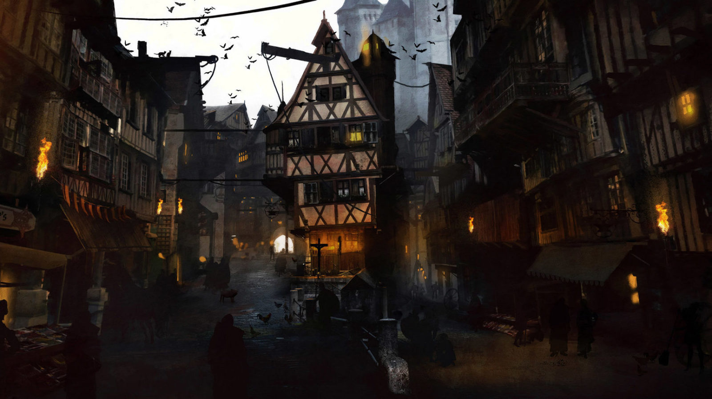
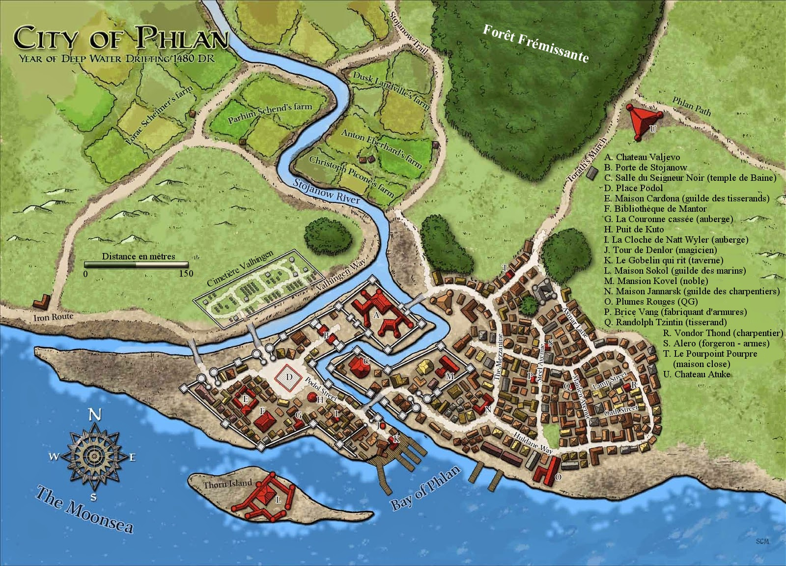

# Bienvenue à Phlan

## La Bouilloire de madame Freona
La Bouilloire de madame Freona est un mystère pour beaucoup. Au sein de la tumultueuse ville de Phlan, c’est un endroit où les gens peuvent aller pour boire ou prendre un repas et s’échapper un temps de la tension des intrigues... et de la faim. L’endroit a la réputation d’être un havre, et les aventuriers qui savent être discrets et bien se comporter peuvent souvent y trouver un emploi.
Les personnages donc ont entendu dire que l’auberge de la Bouilloire de madame Freona était un excellent endroit pour trouver du travail, et c’est pour cela qu’ils s’y sont rendus.

## Carte de la ville de phlan

*source: https://www.reddit.com/r/dndmaps/comments/64ty6a/city_of_phlan_available_at_dms_guild/*

## Ambiance

https://www.youtube.com/watch?v=CY97XoaEjFg
https://www.youtube.com/watch?v=frEJTGfLOhM

## Description
> « ville de 18000 habitants, surplombée par un beau château fait de pierre blanche étincelante. En son sein, la rivière Stojanow s’écoule pour se déverser dans la Moonsea. Phlan est un lieu important de transit des marchandises avec les régions au nord de là, son port est très fréquenté même si la situation politique actuelle est très tendue. Un climat parfait pour des aventuriers ou mercenaires... »

## Scenes

 - > Des corps d’hommes et de demi elfes ayant une oreille coupée pendent le long des murraillles de la Porte de Stajenow, et de la rivière du même nom. Apparement, les Poings Noirs ont fait une sacrée rasia au sein des Acceuillants.

- > Un spectacle de marionnette présente l’histoire de Phlan:
  1. Un dragon de bronze s’installe dans le « Bassin de radiance »
  2. Un groupe d’aventurier dont le nom a été perdu à repoussé se Dragon qui a transformé le bassin en simple source en partant.
  3. Phlan se reconstruit avant que le Vol des Dragons ne détruise de nouveaux, à peine 10 ans après. Les ruines de la ville sont alors occupées par une wyrm géante.
  4. Un agent du Zentharim est venu tuer la wyrm et assoir sa tyrannie.
  5. Son arrière petit fils, Anivar Daoran est présenté comme un mauvais régent, paranoïaque et coats. Insoucieux de son peuple et des réfugiés fuyant les invasions barbares au nord.
  6. Anivar est mort dans un accident de travaux de rénovation du château Valjevo.
  7. Le Commandant des Poings Noirs: Ector Braahms monte sur le trône. On le voit condamner des innocents et répandre la peur dans le peuple.
