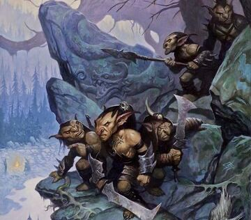
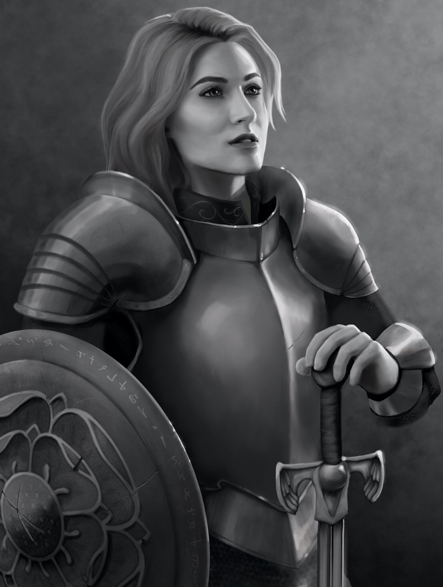
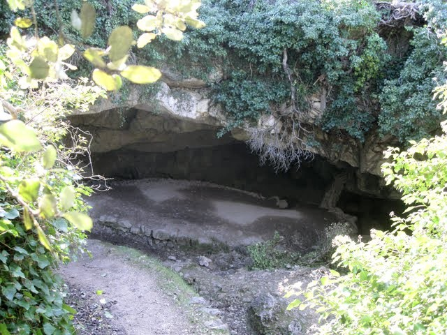
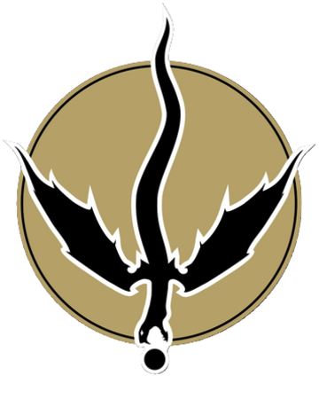

# Des Cris au matin

___
<!-- TOC START min:2 max:3 link:true asterisk:false update:false -->
- [La Femme Affolee](la-femme-affolee)
- [La Capitaine Des Poings Noirs](la-capitaine-des-poings-noirs)
- [La Traque](la-traque)
- [L'Entree du Repaire](lentree-du-repaire)
- [Le Repaire Des Gobelins](le-repaire-des-gobelins)
  - [Descente Dans La Grotte](descente-dans-la-grotte)
  - [Salle Piegee](salle-piegee)
  - [La Salle Des Gardes](la-salle-des-gardes)
  - [Le Chef Et Les Prisonniers](le-chef-et-les-prisonniers)
- [Un Sauvetage Reussi](un-sauvetage-reussi)
<!-- TOC END -->
___

Un cri inquiétant perturbe le déjeuner des personnages à la Bouilloire de madame Freona, comme celui d'une femme en détresse cherchant de l’aide.

> Après le repos d'une nuit paisible, Briez, l'une des cinq filles de madame Freona, vous sert un délicieux petit déjeuner, qui comprend de la confiture de mûres fraîchement préparée et des biscuits chauds.
> « Mes sœurs et moi avons choisi les baies nous-mêmes » dit la jeune femme halfeline, tout en coiffant ses longs cheveux noirs. « Certains disent que les fruits sauvages sont... » Avant que Briez ne puisse finir sa phrase, un hurlement éclate dans la rue, à l'extérieur de la Bouilloire. Si la plupart des mots sont inintelligibles, vous percevez tout de même "aide" et "famille".
{.read}

## La Femme Affolee

> Vous voyez des citadins se précipiter et regrouppé autour d'une voix affolée et de cris de bébé. En ecartant la foule, vous voyez une femme humaine d'environ 30 ans. Elle est effondrée au milieu de la rue, au pied d'un chariot attelé à un cheval tremblant et épuisés. Un citoyen lui tient la main et parvient à la calmer petit à petit. Son récit devient clair:
>
>Elle s'apelle Millivent Moss, sa famille exploite l'argile dans les tourbières à l'est de Phlan.Tot ce matin, son mari, ses enfant et leurs ouvriers on été attaqués par des gobelins. Elle a juste eu le temps de se voir les gobelins emmener les personnes vers l'est. Apparement encore en vie.
> Elle supplie deux gardes des Poings Noirs qui viennent d'arriver en ordonant aux gens de liberer le passage de l'aider à sauver sa famille.
>
> L'un d'eux répond que leurs compétences sont réservées à l'enceinte de la ville. L'un deux jete un coup d'oeil vers vous et apelle un jeune femme en armure qui arrive au loin. "Capitaine Hilda !"
{.read}

## La Capitaine Des Poings Noirs

| **nom**           | Hilda Svendottir                                         |
| ----------------- | -------------------------------------------------------- |
| **description**   | Humaine, ~30 ans, une rune tatouée sur la joue gauche    |
| **comportement**  | très droite, regard de légerement de haut et ton glacial |
| **préoccupation** | Eradiquer la vermine de Phlan                            |

- Elle interpèle le groupe en remarquant que ce sont des aventuriers et qu'il ne semblent pas avoir grand chose à faire.
- Les poings Noirs n'ont pas vocation à secourir l'exterieur de Phlan, ils ont déjà beaucoup à faire dans les quartiers est de la ville.
- Elle donne une note de crédut d'un montant de 50 po à exercer sur les coffres de la ville pour service rendu.
- Elle suggère au groupe de se préparer rapidement (armure, sorts) et de partir au plus tot. Peut-être que ces paysans seront reconaissant, enfin, s'ils sont toujours vivants.

## La Traque

Les joueurs arrivent jusqu'à l'exploitation d'argile.
- Elle est complétement deserte.
- Il y a des traces de lutes.
- Des traces partent vers l'est.
- **[Sagesse (Perception)]** pour les suivre:

| Jet de Sagesse | Information                                                                                                                                                                    | Conséquence                        |
| -------------- | ------------------------------------------------------------------------------------------------------------------------------------------------------------------------------ | ---------------------------------- |
| < 7            | Les sentiers font apparaître qu'environ une douzaine de prisonniers ont été traînés.                                                                                           | Ajouter 2 gobelins dans le repaire |
| 7 - 11         | Les empreintes dans la boue montrent que plus d'une douzaine de créatures de la taille des gobelins sont passées par ici aujourd'hui.                                          | Ajouter 1 gobelin dans le repaire  |
| 12 - 15        | Une créature de plus grande taille accompagnait le groupe. L’emprunte révèle que cette créature était probablement plus grande qu'un humain, mais pas aussi grande qu’un ogre. | /                                  |
| > 15           | Il y a aussi des empreinte de loups                                                                                                                                            | Retirer 1 gobelin du repaire       |

## L'Entree du Repaire

Après avoir traversé les tourbières pendant au moins 1H (ajuster en fonction de la qualité du jet de Survie).

> Vous arrivez au terme de la piste. Le sentier vous a mené à flanc de colline jusque dans une petite cuvette se terminant par la bouche d'une grotte. Vous vous etes plus ou moins caché dans la végétation dense.
{.read}

> Au bout de quelque temps, vous voyez sortir un individus de taille humaine, vétu d'une grande cape, sortir de la pénombre sa capuche masquant son visage et accompagné d'un gobelin.
>
>Le gobelin dit en mauvais commun :
>
>« Un seul groupe de raid de retour. Ils apportaient prisonniers. **D'autres groupes revenir bientôt**. Pas trouver plus de gens avec pièces de serpent ».
>
>L’humain acquiesce et répond : « Excellent. Dis à Gorrunk que mes amis et moi allons payer beaucoup de pièces et donner beaucoup de cadeaux pour tous les artefacts de dragons que vous pouvez trouver. Et tuez tous les autres humains qui s’approchent à proximité de votre repaire ».
>
> Le gobelin hoche de la tête et entre dans la grotte, tandis que la silhouette encapuchonnée chuchote un mot et disparaît.
{.read}

Les joueurs devraient se rendre compte qu'ils ont très peu de temps.

## Le Repaire Des Gobelins

- La tribu des gobelins **Eaufétide** a emménagé dans ces grotes il y a peu.
- Un dragon noir vivait ici, mais il est mort, tué par des aventuriers.
- La présence du dragon y attira d'autres personnes: le culte du Dragon. Ils ont formé une alliance avec les gobelins. Les gobelins creusent et fouillent tandis que le culte leur achète tous les objets en lien avec les dragons qu'ils touveraient.
- Un agent du Zhentarim (pièce à serpent) est venu enquêté et s'est fait capturé par les gobelins. Le culte du dragons a donc ordonné aux gobelins d'effectuer des raids pour qu'aucun autres agent du Zhentarim de réaparaisse au alentours.

| Types        | Description                                                                |
| ------------ | -------------------------------------------------------------------------- |
| **Plafonds** | Tous les plafonds dans le repaire des gobelins sont à 3 mètres de hauteur. |
| **Lumière**  | Sauf indication contraire, l’intérieur de la grotte n’est pas éclairé.     |

### Descente Dans La Grotte

> Le passage est obscur, bien que la lumière du soleil s’étende assez loin dans le couloir de la grotte qui fait près de 3 mètres de large pour vous permettre de voir qu’il se prolonge sur environ 7,50 mètres, avant de tourner vers le sud. Des tas de gravats sont éparpillés dans le passage, suffisamment grands pour que l’on puisse s’en servir pour se cacher derrière. {.read}

#### Gobelins & Meurtrière
- **[Sagesse Perception DD 10]**:
  > Un petit murmures glutural semble venir de derrière le mur à l'est, là ou le passage tourne vers le sud. Il y a des petits trous qui criblent la paroi, permettant à des créature de voir le passage. {.read}
- Des tas de roches sont ammoncelés dans l'entrée. Il permettent aux personnage de se cacher derriere. **[Dexterité (Discretion) DD 10]** permet d'échapper à la vigilance des gobelins.

#### Alarme
- Si les gobelins sont aletés, ils tirent des flèches à travers les meurtrières.
- Les meurtrières leur confère **+5 CA** et aux JdS DEX.
- Après avoir tiré 2 flêches chacun, ils utilisent leur action pour tirer sur la corde d'alarme qui alerte tout le monde
- Après ça, ils restent dans l'alcove.

### Salle Piegee
>Cette chambre est jonchée de couvertures miteuses et de sacs de couchage, des petits os de rongeurs qui ont été mangés, et d'autres restes immondes de l'art de vivre des gobelins. Des fourrures infestées de poux décorent les murs.
{.read}

#### Piège
- un fil a été placé à environ 30cm du sol. Toute créature passant par là déclenche le piège.
- Detectable par **[Sagesse (Perception) DD 10]**
- Desactivable par Outils de voleur + **[Dexterité DD 10]**
- Si le piège est déclenché:
  - Des pièrres tombent sur une zone de 6m de long au nord du piège.
  - Toute créature prend 2d4 dgs (moitié si **[JdS Dexterité DD10]**)
  - L'alarme s'enclenche (voir [Alarme](#alarme))
- Si le piège est désarmé, les autres système d'alarme sont désactivé dans l'ensemble de la grotte

#### Porte secrete

- Un rideau de peaux de loups fait office de *porte secrète*.
- Detectable automatiquement fouillant là ou **[PP 15+]**

### La Salle Des Gardes

> - Si les joueurs ont pu arriver sans être vu, ils ont un round de surprise,
> - Cette pièce légèrement éclairée par un feu de cuisine.

>Comme la salle précédente, celle-ci contient principalement des sacs de couchage et quelques meubles vétustes où les gobelins se reposent et se détendre lorsqu’ils ne sont pas occupés au-dehors à faire les choses horribles que font les gobelins.
> Il y a trois cages contre le mur est, entre deux portes, dont deux abritent chacune un loup. Ceux-ci grognent dans votre direction.
{.read}

#### Liberez les loups !
- lorsque le combat commence, 1 gobelin tire des flèches tandis que les 2 autres courent vers les cages qui detiennent les loups.

### Le Chef Et Les Prisonniers

> - Cette pièce est éclairée par des torches.

>Cette pièce est mieux meublée que les précédentes, avec quelques tables et chaises réparées, un peu de nourriture et de boisson  au fumet agréable, et même une plus grande chaise placée sur une dalle de granit à l'autre bout. Plusieurs passages permettent de sortir de la salle et de s’enfoncer plus profondément encore dans la grotte.
>
>Des gobelins se tiennent autour de la pièce, tous en attente d’un ordre de la part d’un grand gobelours. Deux grandes cages à l'arrière de la salle détiennent les onze prisonniers de la tourbière. En outre, un homme vêtu de sous-vêtements noir, du genre que l’on porte généralement sous une armure, est également dans une cage.
{.read}

#### Combat Contre Gorrunk

- Si les personnages n'ont pas déclenché d'alarme: un round de surprise pour les joueurs. Sinon, les créatures sont prêtes à se battre.
- Si les personnages tuent le Gorrunk les gobelins restant l'abandonnent.

- 💰Gorrunk porte:
  - les clés des cages des prisonniers
  - une poignée de gemme (100po)
  - potion d'escalade

#### Les prisonniers
- les cages peuvent etre ouverte outils de voleur + [Dexterité DD 15]
- La famille de Millivent et les ouvriers sont terrifiés mais sont reconnaissants.
- Le douzième prisonnier est Chaab, l'agent du Zhentarim qui a été capturé alors qu’il enquêtait sur les activités de la secte dans la grotte. Il prévient les joueurs
  > Il y a des dizaines, sinon des centaines de gobelins qui vivent plus loin dans l'antre. La plupart sont parti en raid dans les campagnes environnantes à ce que j'ai compris... mais nous devrions quitter ces lieux avant que le restes de la tribu n'arrive !
  {.read}

#### Evasion

Si les personnages quittent la zone immédiatement, ils ne rencontrent pas plus de gobelins. Si jusque-là le groupe n’a pas été trop inquiété, vous pouvez les impliquer un peu plus en faisant apparaitre quelques gobelins qui se lanceront à leur poursuite.

## Un Sauvetage Reussi

- Les travailleurs n'ont pas grand chose à offrir.
- Chaab laisse le contenu de la bourse aux joueurs mais la récupere.
- Chaab montre au personnage le bouclier qu'il a récupéré dans la reserve personnelle de Gruunk: il est en fait d'écaille d'un dragon noir. C'est un blouclier normal mais un trophée qui peut être porté ave fierté.

#### L'agent du Zhentarim
- En route vers l'exploitation d'argile, Chaab leur révèle:
  > Le Zhentarim a détecté d’étranges événements dans la région. Un dragon noir possédait encore son repaire ici jusqu'à récemment, et il était en contact avec des humains pour une raison encore inconnue. Mais alors que le dragon n'a plus été vu depuis un moment, les humains ont eux continué de rôder dans la région, c'est pourquoi j'étais venu enqueter.
  >
  > J'ai pu constater que le dragon avait été tué par des aventuriers, mais les aventuriers aussi sont morts. Quelqu'un s’est alors emparé du trésor du dragon et a même commencé à récupérer des parties du dragon mort.
  >
  > J'allais m'échapper lorsque j'ai été attaqué. Depuis, j'ai pu voir qe les gobelins étaient en pourparlers avec des humains pour securiser les environs de la grotte. Malheureusement, je n'en sais pas plus sur leur relation.
  {.read}

