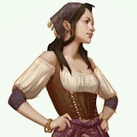
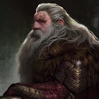

# Le Gobelin Hilare

- [Le Gobelin Hilare](le-gobelin-hilare)
  - [Accroche](accroche)
  - [Les tenanciers](les-tenanciers)
    - [Imizael](imizael)
    - [Gros Mar](gros-mar)
  - [Les Convives](les-convives)
  - [Bagarre](bagarre)
  - [Debrief après la castagne](debrief-après-la-castagne)
  - [Début d'enquête](début-denquête)
    - [Le Bureau Admistratif des Sokol](le-bureau-admistratif-des-sokol)
    - [Le poste de garde des docks](le-poste-de-garde-des-docks)
  
## Accroche

> Vous etes ce soir dans le quartier des docks, à la taverne du Gobelin Hilare. C'est un etablissement connu pour la population qui le fréquente: des marins, manouvriers, mercenaires et filles de joies.
> Il y a une grande pièce principale remplies de tables et du bar, quelques petites cabines sont réparties le long des murs et séparée par quelques rideaux en lambeaux.
>
> L'interieur est peu éclairé mais suffisament pour que vous compreniez que la taverne a eu des jours meilleurs. Le bois est vermoulu, la chaux des murs a jaunie, les chandeliers sont rouillés et recouverts de cire. Quelque tables semblent avoir été réparée plusieurs fois, il manque des pieds à certaines chaises et tabourets.
>
> Vous remarquez une mezzanine en bois au fond de la salle. Il semble y avoir une grande table en bois massif et de long bancs.
> Au milieu un gros poteau en bois est sculpté grossièrement, vous reconaissez la silhouette d'un gobelin, tordu de rire.
>
> Des sons et odeurs d'un plat qui mijote sortent de la cuisine derrière le bar. Vous reconnaissez une forte odeur de chou.
> A cette heure-ci, il n'y a que quelques convives mais la taverne n'est pas completement vide avec ses quelques clients qui sont installés dans les différents coins de la pièce.
> Au bar, une fine humaine au long cheveux noirs est en train de nettoyer des une ardoise tandis qu'un gros bonhomme se dirige vers la cuisine avec gros panier de fruit sur l'épaule. En vous remarquant, il vous crie
> *"Installez vous ou vous voulez ! Enfin, partout sauf à l'étage, j'arrive dans un instant"*
{.read}

## Les tenanciers

[Imizael](imizael) prépare les plats et boissons et "[Gros Mar](gros-mar)" sert à table.

- Ils peuvent proposer
  - le plat du jour: un soupe de chou, servie avec un belle tranche de pain frais et du fromage
  - Un ragout de poissons de roches
  - La pêche du jour, de la perche grillée aux herbes.
  - Toutes sortes de boissons mais le vin n'est pas particulièrement bon ces temps ci.

**le repas coute 3 pièces d'argent.**

### Imizael

|Imizael||
|:------------------:|
|  ||
| **description**         | Humaine, 25 ans, traits délicat et yeux de biche verts. d'aspect à la fois bohème et soignée.        |
| **comportement**        | Douce, concise mais polie                                                                            |
| **préoccupation**       | Le service doit se dérouler sans encombres. Toujours occupée mais attentive aux besoins des clients. |
{.statblock}

Phrases clés:
- *(parlant de Gros Mar) "Il devrait garder son gros nez en dehors des affaires des autres..."*
- *"Si vous n'avez besoin de rien d'autre..."*

### Gros Mar

| Markoth Boufétant  (Gros Mar)||
|:------------------:|
|||
| **description**              | Humain, 30 ans, Souriant, bien bedonnant et un sacré double menton                            |
| **comportement**             | Amical, curieux et Familier                                                                   |
| **préoccupation**            | Souhaite savoir ce que les PJ font dans la vie et est heureux de partager les derniers ragots |
{.statblock}

- il met du temps a arriver mais prend la commande légérement essouflé. Il dit d'un ton très chaleureux *"Bonjour, je suis Markoth Bouffetang. Quelle folle journée aujourd'hui, désolé pour l'attente, que puis-je vous servir ?"*
- Après après avoir pris la commande: "*Excellent choix ! Profitez du poisson frais tant que les bateaux ne se perdent pas dans le brouillard. Avec le phare eteint, ça risque de pas durer très longtemps"*.
- Markoth a entendu plusieurs rumeurs qu'il peut partager si les joueurs discuttent avec lui:
  1. *"Le phare de la forteresse de Sokom, sur l'île de Thorn est éteint depuis 2 jours."*
  2. *"Le fort est très vieux, il a été détruit plusieurs fois, tout comme phlan d'ailleurs."*
  3. **[Wisdom (Insight) DD10]** *"Une légende raconte qu'il y avait un temple sur l'ile et que le fantome d'un prêtre hanterai un trésors caché sous le fort."*
  4. *"C'est la Maison Sokol qui détient le fort. C'est une maison assez récente, fondée et protégée par le premier Lord Protecteur."*
  5. *"La seule raison pour laquelle cette maison s'embête encore avec le cette île sans interet, c'est le phare. C'est une source de revenue sûre et vu l'état du commerce en ce moment..."*
  6. *"Un vaisseau pirates venu des enfers attaquerai des villages sur les cotes de la moonsea... Si c'est le cas, le fort Sokol serait les premieres lignes de défense de la ville"*
- Si les joueurs veulent en savoir plus, il montre discrètement deux femmes dans un recoin sombre de la taverne. *"Elles sont amies avec des Poings Noirs qui auraient disparu et qui étaient en poste sur l'île, enfin, il parrait..."*

## Les Convives

Plusieurs clients sont présents dans la taverne.

Si les joueurs laissent trainer leurs orreiles vers les tables aux alentours:

> Le fait que le phare soit éteint est clairement le sujet du moment. Ni la maison Sokol ni les Poings Noirs ne savent ce qu'il s'est passé. Certains penses que les autorités savent ce qu'ils s'est passé mais que ces lâches sont ont trop peur d'aller voir eux-même.
> Ce qui est sûr c'est que quelqu'un doit s'en occuper bientôt, sinon quelquechose va mal tourner aux docks...

Si ce ne sont pas les tenanciers, alors l'un des convives suppose que les joueurs pourrait peut être faire quelquechose

#### Ortal Gruk
Demi-orc, un marin tatoué et plein de piercing. Il boit seul dans un coin. Quiconque lui payant un verre à droit à une histoire à propos d'un *"esprit vengeur qui vit sous le Fort Sokol, c'est lui qui a eteint le phare pour attirer de nouvelles victimes*

#### Welby & Grent
Deux halfelins marchands de cordages, bois et nourritures séchée venant des terres de Dales à l'ouest. Ils ont principalement bloqués ici par la situation actuelle et ils perdent de l'argent à chaque minute de plus passé ici.

#### Tibeem, Spernik and Ellison
Trois humains tachés d'encre sur leur bras et leurs vetements. Ils partagent un diner et parlent à voix basse entre eux. Ils ignorent toutes interruptions et se remettent à parler à voix basse.

#### Keria & Aravele
Deux femmes qui semblent être des mercenaires portant des brassard Poings Noirs. Elles s'inquiètent pour Grim lui aussi enrrolé recemment chez Poings Noirs et qui a disparu.

## Bagarre

> Après quelques minutes d'interractions avec les NPC, ou bien si les joueurs ne savent pas quoi faire ou s'il commence à parler avec Keria et Aravele.

> Bang ! La porte s'ouvre violemment tandis qu'une demi-douzaine de dockers ivres entrent. Ils semble plutôt enervés et se dirigent directement vers les deux mercenaires.
>
> En tête du groupe, un gigantesque demi-orc aux bras musculeux et le nez tordu. Il s'avance, frappe sur leur table, si fort que leur boissons se renversent.
>
>-- "Vos amis dans l'fort nous coute du travail! Ou est-ce qu'ils se cachent ?! Ces fils de chienne ont trop peur pour allumer l'phare c'est ça ?"
>
>-- "Dégage Thirius, retourne dans le trou d'ou t'es sorti avant que toi et tes ptits copains se fassent mal."
{.read}

#### Desamorcer la situation

- **[Charisme (Persuasion / intimidation) DD 15]** Les joueurs peuvent desarmer la situation. S'ils y arrivent, Izimael les remercie et leur paie une tournée. Les dockers & les mercenaires partagent alors toutes les infos qu'ils connaissent à propos du fort Sokol.

#### Bagarre de taverne
- Imizael et Gros Mar souhaitent eviter l'afrontement pour preserver la taverne. Ils interviennent mais Keria prend la tête de Thirus et l'éclate sur la table, il tombe raide assomé sur le sol. S'ensuit un bagarre à main nu (1 dgts)
- Si les joueurs prennent partie d'un camp il se retrouve face à l'autre:
  - 6 [commoner](/monster/commoner)
  
  ou
  - Keria et Aravele (2 [guard](/monster/guard))

Le combat s'arrête lorsque tous les NPC ennemis soient KO. Alors Imizael pousse une gueulante et tout le monde se retrouve dehors, sur les quais.

## Debrief après la castagne

Après le combat, les deux camps sont dehors à lecher leur blessure. 

Le camp allié remercie les joueurs en partageant les infos qu'ils ont sur le fort Sokol.

S'ils vont voir l'autre camps, il doivent reussir [Charmise (Persuasion) DD10] avec desavantage pour reussir à obtenir leurs informations.

#### Keria & Aravele
- *"Sergent Grim est un gars temeraire et un peu timbré. Il a l'habitude de se fourrer dans les mauvais coups et doit souvent de l'argent à des gens douteux. Il passe son temps a chercher des combines pour de l'argent facile."*
- *"Grim s'est recemment rapproché de Ian Sokol, le quartier-maitre en charge du fort et du phare."*
- *"Grim a parlé d'un trésor caché sous le fort et racontait qu'il était l'aurait bientot trouvé."*
- *"Les poings noirs recrutent largement suite aux rumeurs d'un vaisseau fantome attaquant la côte."*
- ***"Allez parler au Sergent Hurn au poste des Poings Noirs des docks. Il pourras donner plus d'info."***

#### Les dockers

- *"Le fort est hanté par l'esprit d'un clerc mort il y a 101 ans"*
- *"Le fort était un temple pour un dieux..." L'un dit "Thorm, l'autre Tyr et un troisième assure que c'était un culte païen local"*
- *"Il y a un vaisseau fantome  qui attaque les village du coin. Rallumer le phare est une priorité pour s'en proteger !"*
- ***"Liela est l'administratice de la maison Sokol, elle a un bureau aux docks. C'est une noble dame, c'est grace a elle que la plupart d'entre nous avons du boulot."***

Après ces discussions, une petite troupe de Poings Noirs arrivent et les dockers se dispèrsent.

## Début d'enquête

Les PJ peuvent se rendre à deux endroits pour obtenir des informations:

- [Bureau administratif des sokol](le-bureau-administratif-des-sokol)
- [Poste de garde des docks](le-poste-de-garde-des-docks)

### Le Bureau Admistratif des Sokol

|Liela Sokol ||
|:------------------:|
|  ||
| **description**      | Humaine, fin de la 30aine, grande, fine aux cheveux noirs de jaix. Un visage plutot sévères et un regard vif. |
| **comportement**     | Protocolaire, Prudente, Organisée et Directe                                                                  |
| **préoccupation**    | Maintenir les affaires de la maison et eviter tous problème pouvant impacter le commerce                      |
{.statblock}

- Liela est méfiante. Explication par les PC: donne la permission d'enquêter sur l'Ile.
- **[Cha (Deception / Persuasion) DD10]**: se relaxe et ecrit un laisser passer à donner à Karst, le passeur.
- Elle sait:
  - Le fort est géré par Ian Sokol, un jeune déscendant de la maison Sokol.
  - Il y a deux servants: Darvag & Shandra, ils travaillent sur l'ile depuis un moment...,
  - Un contingent de Poings Noirs sont sur place. "Six, si je me souviens bien",
  - Le représentant en charge de ce contingent se trouve au poste de garde des docks,

### Le poste de garde des docks

|Sergant Hurn ||
|:------------------:|
|  ||
| **description**   | Vieux Nain au nez rouge,cheveux et barbe grise, pleinne de miettes, son odeur suggère l'alcoolisme |
| **comportement**  | Négligé, alcoolisé mais fièr                                                                       |
| **préoccupation** | Bientôt à la retraite, plus que 2 ans.                                                             |
{.statblock}

- Hurn accepte immediatement l'enquête des PC, du boulot fait gratuitement.
- Il sait:
  - Sergant Grim est aux commande du contingent sur l'ile de Thorn,
  - Grim est plutot fégnant mais bizarement il veut etre assigné à l'Ile. Ce qui est vu comme une punition en general
  - Le phare est de la responsabilité des Sokol, les Poings noirs ne sont là que pour leur sécurité
  - Le fort est géré par les Sokol, qui ont un bureau un peu plus loin dans la rue,
  - Il suggère d'aller voir Karst, le passeur, en se présentant en son nom. Il les ferra traverser.
