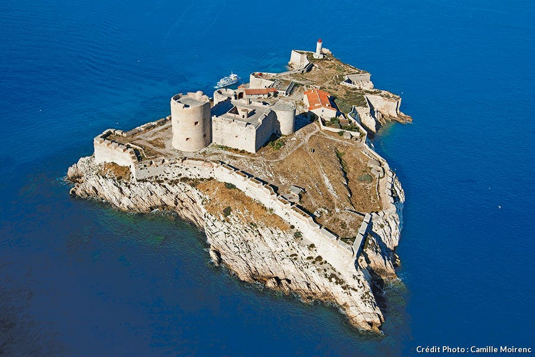

<!--  -->
# L'ile de Thorn et le Fort Sokol

Le fort de Sokol était originairement un temple dédié à Tyr. Construit 200 ans plus tot, il a été détruit durant plusieurs fois, tout comme Phlan.

> **Tyr**,  God of Justice (PHB p294)
> 
> - Alignment: lawful good
> 
> - Domains: Order, War
> 
> - Symbol: Balanced scales resting on a warhammer 

## Traversée vers l'ile de Thorn

- Nager : L'île est à 2 km de la côte (1h de nage). A chaque heure de nage: *DC 15 STR (Athelics)*.
- Bateau :  Un bateau peut être loué pour 5po (+25 po de garantie). Des récifs à l'approche de l'ile necessite *DC 10 WIS (Nature)* de la part du navigateur et *DC 10 STR (Athletics)* pour le rameur.
- Bac : Le bac est la methode la plus simple pour se rendre sur l'île. Karst, le passeur propose la traversée pour **1po par personne (gratuit si lettre de mission des Poings Noirs / Sokol)**.

| Karst               |     |
| ------------------- | --- |
|  |     |
| **description**     |   Vieux aux aux cheveux blanc et barbe hirsutes, il porte une grande cape cirée et crapotte une pipe |
| **comportement**    |   Grognon, Peu bavard mais  |
| **préoccupation**   |  Assurer ses vieux jours, il aimerait quitter la ville qui devient difficile à vivre pour lui mais se sent trop vieux pour ça   |
{.statblock}

> #### Ce que sait Karst
> - Il connait Darvag, Shandra et Rorin, les concierges du Fort. Il les a vu la veille. Ils paraissaient en bonne santé,
> - Il y a une garnison de 6 poings noirs sur l'île,
> - La garnison de l'ile est considéré comme une punission,
> - Il ne connait pas les rumeurs d'esprit vengeur mais se souvient que sa grand mère lui disait que l'île était remplie de fantômes.

## Enquête au Fort Sokol

### Quartier d'Igan

### Phare

### Tour Est

### Tour Ouest
