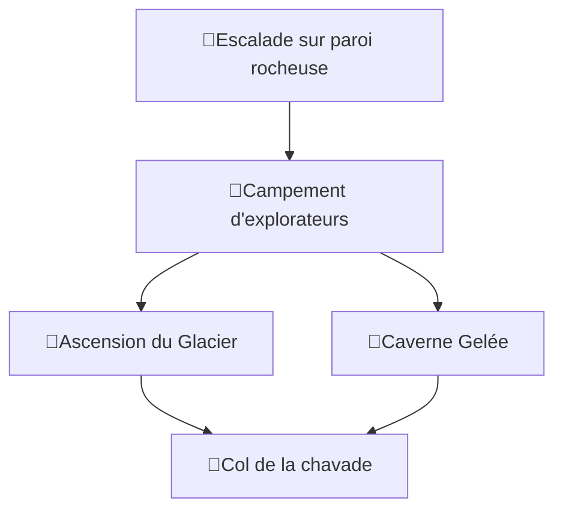

#📍Lieu

> [!QUOTE] Description
> Surplombant votre position, une gigantesque montagne. Son sommets, ou plutôt *ses* sommets sont formées de deux pics pointant l'un vers l'autre et séparé par une crevasse. Reidoth vous explique qu'on l'appel le pic du duel.
> 

# Structure

# Epreuves
- [🎲Escalade sur paroi rocheuse](../épreuves/🎲Escalade%20sur%20paroi%20rocheuse.md)
- [🎲Ascension du Glacier](../épreuves/🎲Ascension%20du%20Glacier.md)
- [🎲Caverne Gelée](../épreuves/🎲Caverne%20Gelée.md)
# Découvertes
- [🔎Campement d'explorateurs](../découverte/🔎Campement%20d'explorateurs.md)
- [🔎Col de la chavade](../découverte/🔎Col%20de%20la%20chavade.md)