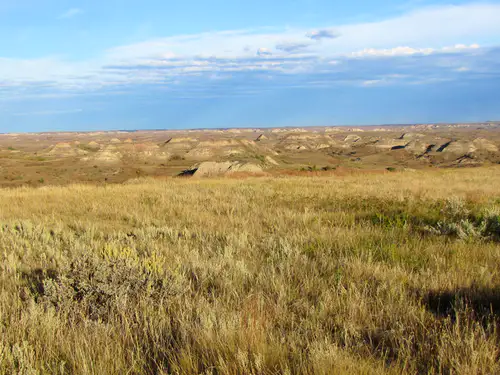

# Hauts Plateaux
 =300x){.float-right}

- Le sentier continue jusqu'à une forêt en pente d'arbre nains et courbés par le vent.
- limite d'altitude des arbres ~2500m.
- A la sortie de la forêt, essouflé par les zigzag pentus parcourant cette forêt, s'etend devant un terrain  desormais plat, mais parsemé de petites colines, sur plusieurs kilometre. Ici le vent soufle tranquilement par saccade, faisant plier l'herbe bien verte et grasse de cette zone humide où aucun arbre ni arbuste ne pousse.
- Reidoth montre au loin, on peut appercevoir les deux pics encadrant le fameux col de la Chavade.
- Après quelques heures de marches agréable mais très monotone, la nuit tombe.

