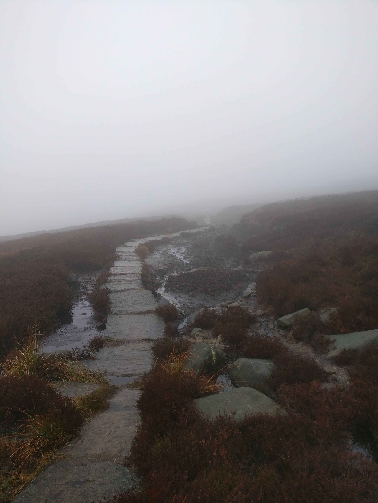

# Tourbière Embrumée

## Description
>  La brume devient brouillard, le soleil est complètement occulté par les goutelette d'eau en suspension dans l'air. Une odeur croissante de humus et de putrefaction saisie vos narines.

>  Le sol devient meuble puis complètement boueux avant de laisser place à d'epaisses dalles de pierres  rectangulaires sur lesquelles sont inscrites __en orc__ "Royaume de Gazog". Elles sont le seul moyen de progresser sans s'enfoncer dans la glaiser jusqu'au genou.

>  Le vent se lève de nouveaux, mais le brouillard reste. La temperature chute et l'air devient glacial tendi que vos visage sont foutté par les particules d'eau en suspension. Les volutes de brouillard vous laisse entrevoir des petits ruisseau
>  

## Lore

