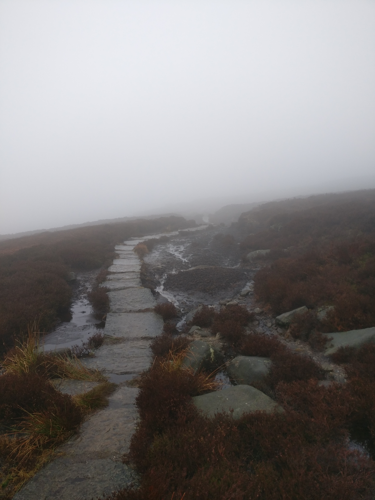

# Session 07 - 2021/07/04

## Strong Start

## Scènes: Traversée des montagnes

Les PJ seront confrontés a differents types d’obstacles: le terrain, la meteo, la température, finalement la nature et les monstres.
La traversée est organisée en 3 paliers:
1. Vallée: Le long du torrent appelé Vénéon,
2. Moyenne montage: Les hauts plateaux marécageux de Gazog,
3. Haute montagne: Col de la Chavade 

### Vallée du Vénéon

#### L'arbre couché

- La falaise derrière la cabane est comme fendue en deux, un sentier se dessine, serpentant a travers les éboulis et rochers qui constituent un abrupt pierrier.
- Séparant la douce vallée de ce mur de pierre meubles, les gorges du torrent, profondes d'une dizaine de metres, creusées par l'eau puissante du Vénéon qui s'écoule depuis la cascade.
- En travers, un tronc d'un chêne gigantesque (6m de diamètre).

 Obstacle:
- [x] Le pont précaire

   Le tronc est humide, recouvert de mousse: glissant nécessite DEX 10. Si echec, JdS DEX DD10 pour se rattraper. Si chute dans l’eau, athetics DD15 pour garder la tete au dessus de la surface et voir un tronc/branche pour s’y accrocher puis remonter. Une créature [peux rester 1+CON mod minutes sans respirer](https://5e.tools/book.html#phb,8,suffocating,0).

#### Le Pierrier

Si le sentier est correctement tracé dans le pierrier en bas de ce dernier, le chemin devient vite un tas de cailloux instable et glissant. L'ascenscion du pierrier est dangereux et difficile, surtout avec beaucoup d'équipement à porter.

 Obstacles:
- [x] Terrain difficile:
  
  Test d'Athletisme ou Dexterité brute DD10. Si echec, le PJ glisse en contrebas et perd beaucoup d'energie pour remonter: 1 point de fatigue.
  
- [x] Pierres Animées. 
  
  Un chapelet de pierres etrangement blanches et rondes s'anime en levitant. Considéré comme un [animated object (large)](<https://5e.tools/bestiary.html#animated%20object%20(large)_phb>).

### Hauts Plateau Marécageux de Gazog

#### Corniche venteuse

- Une corniche perchée à plusieurs centaines de metres de haut au dessus de la valée du vénéon est visible en contrebas.
- La végétation est éparse, petite et sêche: adaptées aux conditions difficile d'altitude et au vent puissant qui vous déstabilise par sa puissance.

Obstacles:
- [ ] Les tourteraux

  Un couple de deux jeunes Géants des Pierres, recemmments installés dans la région essaient de surprendre les joueurs au detour d'une piste.  Perception DD 12 pour reperer des "rochers étranges surplombant le sentier".  
  Les deux Géants de Pierre sont jeunes, leur [Challenge Rating est réduit à 3](https://5e.tools/bestiary.html#stone%20giant_mm,scaled:3)

  
   
  

- [ ] Vent puissant
  Lorsque qu'un joueur se retrouve au bord de la corniche, il y a 1 chance sur 2 qu'une bourrasque de vent se produise à son tour. Le joueur doit reussir un JdS de Force DD 14 ou se retrouver poussé de 3m en direction du précipice.

#### Arrivée sur les hauts plateaux
 
- Le sentier continue jusqu'à une forêt en pente d'arbre nains et courbés par le vent.
- limite d'altitude des arbres ~2500m.
- A la sortie de la forêt, essouflé par les zigzag pentus parcourant cette forêt, s'etend devant un terrain  desormais plat, mais parsemé de petites colines, sur plusieurs kilometre. Ici le vent soufle tranquilement par saccade, faisant plier l'herbe bien verte et grasse de cette zone humide où aucun arbre ni arbuste ne pousse.
- Reidoth montre au loin, on peut appercevoir les deux pics encadrant le fameux col de la Chavade.
- Après quelques heures de marches agréable mais très monotone, la nuit tombe.

Obstacle:
- [ ] Attaque nocture
  3 Hyènes géantes affamée s'approchent discretement du campement. au 2eme tour de garde. Le personnage montant la garde doit avoir une PP supérieure à 1d20+2 pour detecter les hyènes et ne pas être surpris.

#### Tourbières Embrumées

- Un ciel chargé et un crachin fin se met à tomber au reveil.
- Le ciel s'assombrit de plus en plus, la visibilité diminue, l'air est saturé d'humidité et le vent emportant la pluie vous fouette le visage.
- Après 1 ou 2  heures de marche, des flaques et de petits étangs aparaissent. Le sol est de plus en plus meuble et recouvert d'une mousses vert foncé gorgée d'eau. 
- Le sentier  boueux laisse place à d'epaisses dalles de pierres scuplées en rectangle. Posées sur la glaise, elles sont le seul moyen de progresser sans s'embourber jusqu'au genou.Un peu plus loin, un étang parfaitement statique, large d'une 100aine de metre se trouve à gauche du sentier.
- Obstacle: Croco
- La piste de pavé s'interompt pour laisser à un grand trou circulaire. Une sorte de cratère dans lequel s'écoule continuellement de la boue vers le fond. Reidoth suggère de contourner le cratère mais cela requière de s'enfoncer dans la glaise. 
- Lors du contournement, obstacle: Monticule.
- La lumière traversant le brouillard change de teinte en devenant jaune orangée, on devit que la journée touche à sa fin. Le vent se calme, le brouillard, déjà épais, s'opacifie brutalement: il semble sortir du sol.

Obstacles:
- [ ] Croco !

  3 crocodiles bicéphales sont tapis sous la surface de l'eau (Perception DD 17) ils attaquent dès que les joueurs passent près d'un plant d'eau.

- [ ] Monticule
  
  Un ["Monticule Ambulant"](https://5e.tools/bestiary.html#shambling%20mound_mm,scaled:3) se déplace furtivement sous le brouillard (Perception DD17) pour absorber par surprise les PJ.

- [ ] Etablir le camp  

  La navigation devient très difficile et tout le monde est épuisés et trempé, Reidoth suggère de trouver un endroit pour etablir le camp.
  Survie DD 15, chaque essaie se fait a interval de 30 min de marche. Tous les 2 essais, le groupe fait un JdS de constitution contre effet de fatigue.
  Lorsque réussi les joueurs trouvent un monticule de rocher laissant suffisament de place pour s'installer sur un sol dur.  

### Le col de la Chavade

#### Une falaise à grimper

- Chute de PJ, 
- Chute de rocher
  
#### Ascenssion d'un glacier

- Avalanche, 
- [6 Mephit de Glace](https://5e.tools/bestiary.html#ice%20mephit_mm,flsttype:beast=2,floptype:extend,flstenvironment:arctic=1,flopenvironment:extend)

#### Arrivée au sommet

Scene splendide

## Secrets & Clues

- [ ] Cet itinéraire était empreinté autrefois comme raccourci par les coursiers transportant des messages urgents depuis Eauprofonde et La porte de Baldur verts Padiver.
- [ ] Si un joueur scrute avec concentration son environnement, Perception DD15, il peut appercevoir un petit scintillement au loin. En s'approchant, le groupe découvre un coffret à moitié enfoui sous une motte de terre. Il contient:
  - 204 PO
  - [Bottes des Contrées Hivernales](https://www.aidedd.org/dnd/om.php?vf=bottes-des-contrees-hivernales)
  - [Corde d'escalade](https://www.aidedd.org/dnd/om.php?vf=corde-d-escalade)
  - [Une potion d'escalade](https://5e.tools/items.html#potion%20of%20climbing_dmg)

- [ ] Gazog était un roi Orc qui régnait sur les tribues barbares des hauts plateaux. Mécontent de voir de nombreux étrangers traverser ses terres, il organisait des embucades et autres pièges afin d'empecher tout convoit. Mais, les émissaires et coursiers, bien trop rapide pour que l'organisation approximative et et les plans souvents trop compliqués de Gazog soient efficaces, continuait d'empreinter cet itineraire malgré la menace.
- [ ] Les sentiers du col de la chavade vu abandonés, les marécages désormais assechés plus loin le long de la cote au sud ouest permettaient un passage plus rapide et plus sûr. Mais la légende raconte que Gazog, obsédé par ses pièges et stratagèmes, poursuivi frénétiquement ses activité pendant de longue années. Laissant grandir sur ces terres une menace bien plus sombre que sa folie qui causa sa perte ainsi que celle de ces clans.