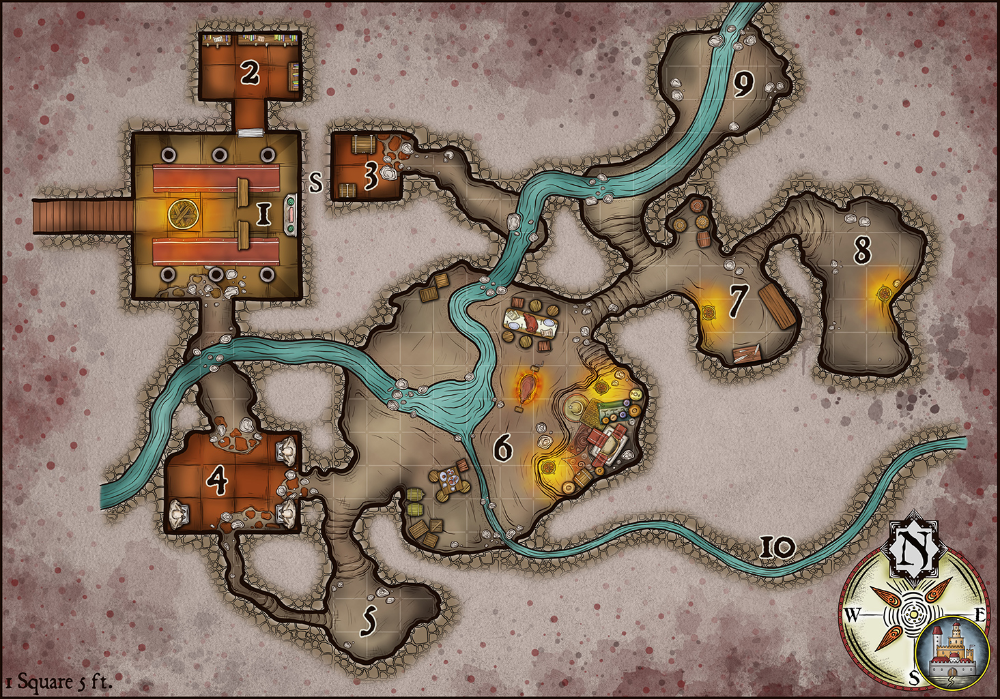

# Cultist Hideout

## About this Resource

This resource features the general description of an adventure location for RPG adventures or general inspiration. Not all releases are the same; some may include rules material for Dungeons and Dragons 5e but mechanics are left to a minimum.

These adventure ideas that are appropriate for low to mid-level (Levels 1 to 5) adventur­ing parties. As the DM, you are free to change or modify any or all the information found here. NPC names and settlement names are the first you should consider changing to accommodate any homebrew-world lore.

When monsters are referenced, the creature’s [name](/monster/goblin) is noted in bold. Only creatures from the D&D5e Monster Manual are cited.

# Adventure Hooks

Below is the description of an underground location used as the hideout for a cult or similar group of evil worship. The identity of any NPCs or their motives are left up to the interpretation of the DM. As it is, the location and presence of an evil faction are a simple enough feature to integrate into any ongoing games. Below are a few suggestions of adventure hooks to send PCs this way.

1. The cult leader will soon try to summon and bind another demonic creature. To do this, the cultist needs three human sacrifices. These people were kidnapped and are still alive and well in Area 8. The PCs are charged with rescuing said NPCs before they are sacrificed in an evil ceremony.
2. The PCs come across a tome about the binding of demonic creatures. They obtained this valuable item just before the cult leader. The cultist sends his minions to kidnap one of the PCs or steal an important object they own. The PCs visit the cultist hideout without knowing that the cultist plans to use them as human sacrifices for a depraved ritual.
3. The cult leader is testing his new poisonous substance by pouring it in the city’s water supply. So far, more than 20 people have died from it. Others are slowly losing their energies after so many days with little to no water. The PCs are sent to investigate the origins of the underground stream that feeds the water supply.

# Location Descriptions

**Locations:**

* [1. Temple Nave](1-temple-nave)
* [2. Temple Library](2-temple-library)

## 1. Temple Nave

A flight of carpeted stairs leads down to the main temple nave. A large brazier in the middle of the room dominates the chamber. There are six stone pillars, two benches, and an altar to an obscure dark entity. The wooden door leads to the library ([Area 2](2-temple-library)). A passive Perception score of 16 or higher reveals the presence of different color bricks on the east wall. They suggest the location of a secret passage (to Area 3).

Four cult members can be found here at any given time. 3 [cultists](/monster/cultist) and 1 [acolyte](/monster/acolyte). A golden necklace on the altar shelf is worth 200 gp.

## 2. Temple Library

The room is small and contains three bookcases only. There are no reading tables or furniture. The cultist fanatic and acolytes keep this library well organized and only they carry keys for the door. The main collection consists of works of poetry, epic tales, and treaties on magic subjects. There is a spellbook with several wizard spells up to 5th level.

A thorough search unearths 4 magic scrolls with random spells (up to level 3) on them. 

## 3. Secret Stash

The cult leader hides the most valuable treasure and documents in two chests in the secret room. There are two ways to reach this location. Either by using the secret passage in Area 1 or by swimming through the wall from Area 6 or 9. The cult leader placed two protective measures on the chests to prevent even his own men from stealing the contents. Each chest is protected with an explosive runes spell. Additionally, A xorn loyal to the cult leader is always nearby, he has very specific instructions. If people other than the cult leader gain access to the room and try to open any chest, the xorn uses its ability to move through the earth to cause a collapse on both sides of the passage. Effectively trapping any unwanted visitors inside.

The chests contain an old tome of magic on the summoning and binding of demons, 400 gp, 2 potions of healing, and a +1 dagger. 

## 4. Undying Guardians

Three androgynous statues dominate the chamber (gargoyles or stone golems). The statues lack any kind of facial features or sculpted clothes. They appear mannequin-like, but with muscular bodies. The three statues are the prideful creations of the cult leader. Each statue is a prison to the essence of a demon. The cult leader performed a successful summoning and binding spell to create them. The statues follow all of the leader’s commands. Currently, their only instruction is to stop anyone who does not belong to the cult. 

## 5. Mushroom Garden

The evil cult prepares elaborate poisons for their bladed weapons. All of their poisons use certain mushrooms and fungi they grow in this chamber. Some of the fungi grow on the floor of the chamber while other kinds grow on hanging shelves all around the room. 

## 6. Main Hideout

This is the largest chamber in the complex. An underground natural stream passes through this chamber. The water flows north to south. A smaller stream with low current joins the larger one at a pond in the middle of the chamber. The ceiling is 30-feet-high. There are two tables where cult members share their daily meal, surrounded by several crates and barrels.

An elevated section of the chamber is where the cult leader is most of the time. Flanked by two lit braziers and surrounded by expensive rugs, carpets, and vases, the large throne-like chair dominates that corner of the room. There are 4 cultists, 2 acolytes, and the cultist fanatic in the room. Collectively, the valuable objects and art next to the throne are worth 1700 gp. 

## 7. Armory and Laboratory

The cult keeps enough weapons for their members, most of them are simple short swords and daggers. The cult leader and an apprentice also use these facilities to prepare poisons. This is a delicate art which the cult leader will not teach any member of the cult. Their poisons stash is kept on a wooden box under the table. If sold in the black market, it is worth 600 gp. 

## 8. Cells

This part of the cave complex is reserved for holding prisoners. The cells are seldom used. The last time they were used was because the cult leader needed three human sacrifices to bind the spirits of three demons to the statues in Area 4. The worthless belongings of those poor prisoners are still inside the room. The ritual destroyed their bodies, nothing remains of their material existence. 

## 9. Natural Stream

The stream comes from the soil, from an underwater channel. The cultists do not know where this stream is originated. The current is strong enough that most people will not be able to swim against the current to explore the underground reaches beyond. 

## 10. Secret Exit

The cult leader and his closest allies know that it is possible to escape the hideout through this secondary stream. It involves walking against the water current but it is not strong enough to pose a considerable threat. After half a mile, the narrow meandering tunnel reaches a larger cave close to the surface.

# General Features

These are the general features an underground cultist hideout. It is inside an underground temple and a complex of adjoining natural caves. The Location of the whole complex is left vague on purpose.

*Terrain.* The stone floor tiles of the temple sections are old, some of them already decaying and breaking. The natural cave sections feature rough packed soil. Only areas with large rocks or pieces of furniture are considered to be difficult terrain for the purposes of tactical movement.

*Doors.* The single wooden door connecting Areas 1 and 2 has a simple lock. A successful DC 13 Dexterity (Thieves Tools) check allows a character to open the door.

*Light.* There are several braziers throughout the dungeon. Areas, where a brazier is located, are brightly lit. Areas at least 30-feet away from any brazier are in complete or partial darkness.

*Smells and Sounds.* The smell of burning coal and smoke is ever present due to the lack of proper ventilation in the caves. When the cultists cook something in Area 6, the smell can be detected as far as Area 1.

