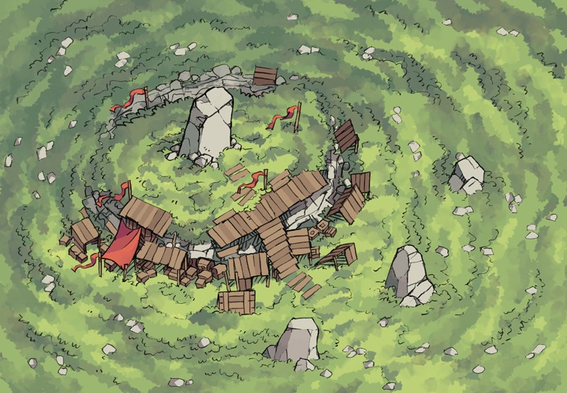
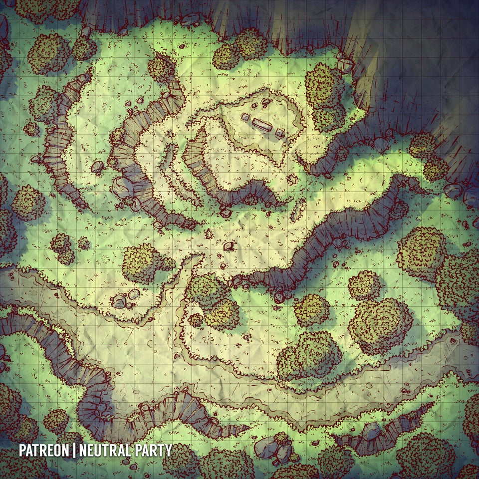
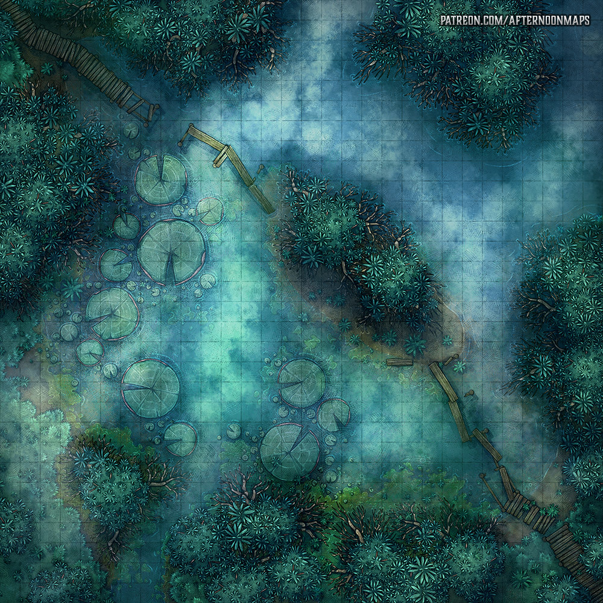

# Special Locations

- [Goblin's camp](module/hexploration/page/goblins-camp)
- [Ogre's Home](module/hexploration/page/ogre-home)
- [Harpies's Nest](module/hexploration/page/harpies-nest)
- [Vegepygmy Patrol](module/hexploration/page/vegepygmy-patrol)

## Goblins Camp
A small camp of a 6 [goblins](monster/goblin) organized arround a huge stone pillar.

## Ogre Home
A couple of [Ogre](monster/ogre) are iving in a muddy pit between two hills. A huge pot stimming on a burning log in the center and a shelter made of big rocks, rottent animal skin and clothes.

## Harpies Nest
A bunch of [Harpies](monster/harpy) recently built their nest on top of a cliff. They have babies to feed.

## Vegepygmy Patrol
6 of these [fungus creatures](monster/vegepygmy) are patroling the swamp. They follow and stay hidden in a never lasting cloud of fog. Each day, the fog moves randomly to one adjacent hex.
